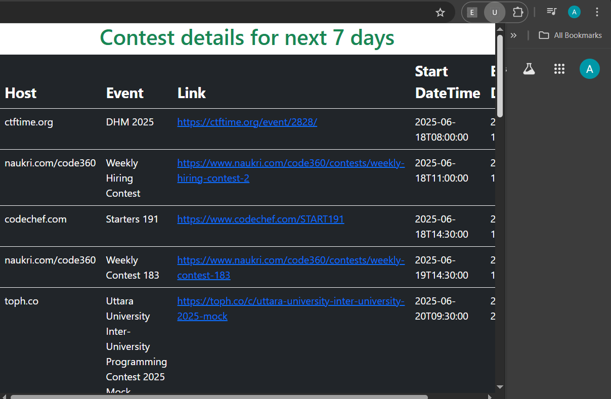

# Upcoming Contests Extension

A simple Chrome extension that displays upcoming coding contests from various platforms using the Clist API. Built with HTML, JavaScript, and Bootstrap.

## 📸 Screenshot

## ✨ Features

- Displays contests for the next 7 days
- Uses the [Clist API](https://clist.by/api/v2/doc/)
- Responsive UI with Bootstrap
- Works as a Chrome Extension

## 📁 Project Structure
upcoming-contests-extension/
├── index.html # Popup UI for the extension
├── script.js # Fetches contest data from Clist API
├── manifest.json # Chrome extension configuration
├── README.md # Project documentation
├── screenshots/
│ └── preview.png # Screenshot shown in README

## 🚀 How to Use

1. Go to `chrome://extensions/` in your browser.
2. Enable **Developer Mode**.
3. Click **Load unpacked** and select this folder.
4. Click the extension icon to view upcoming contests.

## 🙋‍♀️ Author

**Anushka Nawale**
